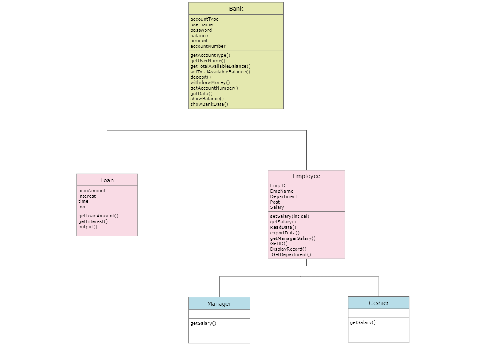
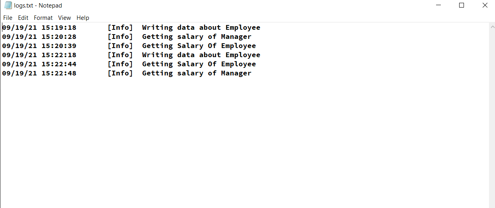

# Bank-and-Employee-Management

## Table of Contents
* [About the project](#About-the-project)
* [Class-diagram](#Class-diagram)
* [Functionalities provided](#Functionalities-Provided)
* [Logger](#Logger)

## About this Project
A single project which implements the following concepts of c++:
  *   Thread
  *   Polymorphism
  *   Input/Output Files 
  *   Exception Handling
  *   Data Structure - Array
  *   Inheritance
  *   Logging Mechanism
  *   Header files
  *   Constructor
  
## Class Diagram

I have implemented 5 classes namely Bank class, Employee class, Manager class, Cashier Class, Loan class.
## Functionalities Provided
Bank Management
 1. Create an account
2. Withdraw Amount
3. Deposit Amount
4. Show Balance
5. Show Bank Data
6. Loan Applications
7. Exit

Employee Management :
1. Enter new record about Employee
2. Set Employee's Salary
3. Get Employee's Salary
4. Get Employment ID
5. Get Department
6. Export Data
7. Get Manager's Salary

Loan Applications
1. Get Loan
2. Get Loan Applications Details
3. Exit

## Logger

I have implemented a logger which has different levels of priority and it logs everyting we do in a seperate log file with the timestamp and date.

